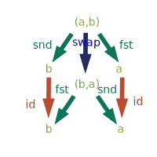
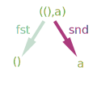

# Problem set 2

Questions are from:

http://brendanfong.com/programmingcats_files/ps2.pdf

## Question 1: Functors out of Set
1. All sets are mapped to '1' and all morphims are mapped to <a href="https://www.codecogs.com/eqnedit.php?latex=id_{1}" target="_blank"></a>

Because:
* <a href="https://www.codecogs.com/eqnedit.php?latex=\forall&space;s&space;\in&space;Ob(\mathbb{S}),&space;F(id_s)=id_{1}=id_{F(s)}" target="_blank"></a>
* <a href="https://www.codecogs.com/eqnedit.php?latex=F(g&space;\cdot&space;f)&space;=&space;id_1&space;=&space;id_1&space;\cdot&space;id_1&space;=&space;F(g)&space;\cdot&space;F(f)" target="_blank"></a>

2. Similarly, all sets can be mapped to '2' and all morphims are mapped to <a href="https://www.codecogs.com/eqnedit.php?latex=id_{2}" target="_blank"></a>

3. Also, all sets can be mapped to '3' and all morphims are mapped to <a href="https://www.codecogs.com/eqnedit.php?latex=id_{3}" target="_blank"></a>

4. <a href="https://www.codecogs.com/eqnedit.php?latex=\emptyset" target="_blank"></a> is mapped to '1' and all sets mapped to '2'

Because
* <a href="https://www.codecogs.com/eqnedit.php?latex=F(id_{\emptyset})=id_1=id_{F\(\emptyset)}" target="_blank"></a> and <a href="https://www.codecogs.com/eqnedit.php?latex=F(id_{s})=id_2=id_{F\(s)}" target="_blank"></a> for all Sets 's' which are not the empty set
* All morphisms from the empty set to the empty set are mapped to <a href="https://www.codecogs.com/eqnedit.php?latex=id_1" target="_blank"></a>, all morphisms from the empty set to a non empty set are mapped to 'a' and all morphisms from non empty set to non empty sets are mapped to <a href="https://www.codecogs.com/eqnedit.php?latex=id_2" target="_blank"></a>. There are no morphisms from non empty set to the empty set (because the empty set does not have any target object).

For  f : X → Y and g : Y → Z {\displaystyle g\colon Y\to Z, the possible compositions are:

|X|Y|Z|Proof|
|-|-|-|-----|
|non empty set|non empty set|non empty set|<a href="https://www.codecogs.com/eqnedit.php?latex=(g&space;\cdot&space;f)&space;=&space;id_2&space;=&space;id_2&space;\cdot&space;\id2&space;=&space;F(g)&space;\cdot&space;F(f)" target="_blank"></a>|
|empty set|non empty set| non empty set|<a href="https://www.codecogs.com/eqnedit.php?latex=F(g&space;\cdot&space;f)&space;=&space;a&space;=&space;id_2&space;\cdot&space;a&space;=&space;F(g)&space;\cdot&space;F(f)" target="_blank"></a>|
|empty set|empty set|non empty set|<a href="https://www.codecogs.com/eqnedit.php?latex=F(g&space;\cdot&space;f)&space;=&space;a&space;=&space;a&space;\cdot&space;id_1&space;=&space;F(g)&space;\cdot&space;F(f)" target="_blank"></a>|


5. <a href="https://www.codecogs.com/eqnedit.php?latex=\emptyset" target="_blank"></a> is mapped to '1' and all sets mapped to '3' with all morphisms from the empty set to a non empty set are mapped to 'b . a' 

6. <a href="https://www.codecogs.com/eqnedit.php?latex=\emptyset" target="_blank"></a> is mapped to '2' and all sets mapped to '3' and all morphisms from the empty set to a non empty set are mapped to 'b

## Question 2. Constant functors
a. With <a href="https://www.codecogs.com/eqnedit.php?latex=K_B" target="_blank"></a> all elements are mapped to set<a href="https://www.codecogs.com/eqnedit.php?latex=B=\{&space;T,F&space;\}" target="_blank"></a> and all morphisms are mapped to the identity function <a href="https://www.codecogs.com/eqnedit.php?latex=Id_B" target="_blank"></a> so it is obvious the preservation of identities and composition laws are true.

b.

```haskell
data BooleanFunctor a = BooleanFunctor Bool

instance Functor BooleanFunctor where
  fmap f (BooleanFunctor a) = BooleanFunctor a
```

## Question 3. The naturality of the diagonal
a. <a href="https://www.codecogs.com/eqnedit.php?latex=\delta&space;:&space;id_{Set}&space;\Rightarrow&space;Double" target="_blank"></a> is a natural transformation for <a href="https://www.codecogs.com/eqnedit.php?latex=f:c_1&space;->&space;c_2" target="_blank">&space;c_2" title="f:c_1 -> c_2" /></a> with <a href="https://www.codecogs.com/eqnedit.php?latex=\delta_X(x)&space;=&space;(x,x)" target="_blank"></a> because:

* <a href="https://www.codecogs.com/eqnedit.php?latex=F(c_1)=id_{Set}(c_1)=c_1" target="_blank"></a>

  <a href="https://www.codecogs.com/eqnedit.php?latex=F(f)(F(c_1))=(id_{Set}&space;\cdot&space;f)&space;(c_1)=f(c_1)=c_2" target="_blank"></a>
  
  <a href="https://www.codecogs.com/eqnedit.php?latex=F(c_2)&space;=&space;id_{Set}(c_2)&space;=&space;c_2" target="_blank"></a>
  
  <a href="https://www.codecogs.com/eqnedit.php?latex=\delta_{c_2}&space;(F(c_2))&space;=&space;\delta_{c_2}(&space;id_{Set}(c2))&space;=&space;(c_2,c_2)" target="_blank"></a>
  
* <a href="https://www.codecogs.com/eqnedit.php?latex=\delta_{c_1}(F(c_1))&space;=&space;\delta_{c_1}(id_{Set}(c_1))&space;=&space;(c1,c1)" target="_blank"></a>
 
  <a href="https://www.codecogs.com/eqnedit.php?latex=G(c_1)&space;=&space;(c1,c1)" target="_blank"></a>
  
  <a href="https://www.codecogs.com/eqnedit.php?latex=G(f)((c_1,c_1))&space;=&space;Double(f)((c1,c1))&space;=&space;(f(c_1),f(c_1))&space;=&space;(c_2,&space;c_2)" target="_blank"></a>

b.

```haskell
$ ghci
GHCi, version 7.10.3: http://www.haskell.org/ghc/  :? for help
Prelude> let diag x = (x,x)
Prelude> :show bindings
diag :: t -> (t, t) = _
```

## Question 4. Uniqueness of universal objects

a. if t and t' are terminal then it exists 2 morphisms such as:
 
  *<a href="https://www.codecogs.com/eqnedit.php?latex=f:t&space;\mapsto&space;1" target="_blank"></a>
  * <a href="https://www.codecogs.com/eqnedit.php?latex=f':t'&space;\mapsto&space;1" target="_blank"></a>

  We can also define the following 2 morphisms:
  * <a href="https://www.codecogs.com/eqnedit.php?latex=g:1&space;\mapsto&space;t" target="_blank"></a>
  * <a href="https://www.codecogs.com/eqnedit.php?latex=g':1&space;\mapsto&space;t'" target="_blank"></a>
  
  So we have:
  * <a href="https://www.codecogs.com/eqnedit.php?latex=g'&space;\cdot&space;f&space;:&space;t&space;\mapsto&space;t'" target="_blank"></a>
  * <a href="https://www.codecogs.com/eqnedit.php?latex=g&space;\cdot&space;f'&space;:&space;t'&space;\mapsto&space;t" target="_blank"></a>
  
  So t and t' are isomorphic
  
b. Using fst and snd from lecture 6 I can define an identity function from p=(a,b) to p'=(a,b):

<a href="https://www.codecogs.com/eqnedit.php?latex=(id_a&space;\cdot&space;fst&space;,&space;id_b&space;\cdot&space;snd)&space;:&space;p&space;\mapsto&space;p'" target="_blank"></a>
  
The function also works from p' to p so p and p' are isomorphic

c. Both demonstrations rely on function composition 

## Question 5: Products in preorders

a. As 42 = 3*14 and 27 = 3* 9, their product in that category is 3*14*9 = 378. The operation is the lowest common denominator.

b. The product of {a,b,c} and {b,d,c} is {a,b,c,d}. The operation is the union on sets.

c. The product of true and false is 'true' (as true implies true and false implies true) so the operation is 'or'.

## Question 6: Products in Hask

a. swap



b. unit


